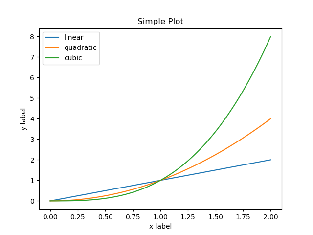
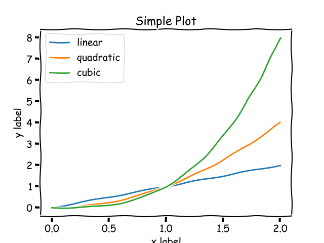
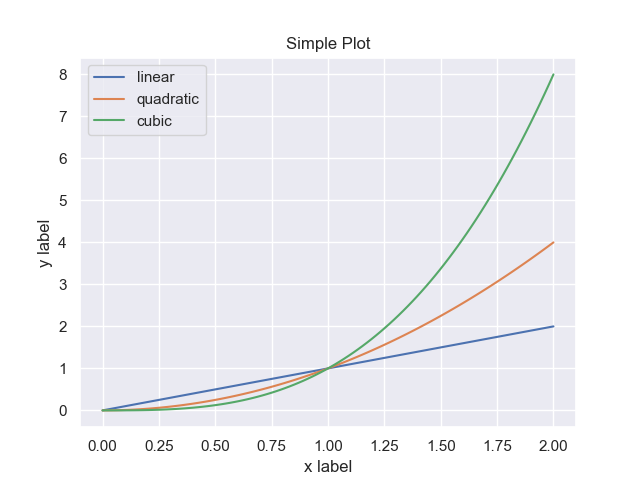

The basis of this course in a nutshell: _to create better scientific or engineering visualizations_.

If we consider looking at typical scientific- or engineering-based plot going to be put in a journal publication or web article, we will want that imagery to be easily understandable, represent the data accurately, and remove any unwanted distrations that may misrepresent the data or confuse the user/reader. Typically, this involves a process as follows:


[(Image Source)](http://www.randalolson.com/2014/06/28/how-to-make-beautiful-data-visualizations-in-python-with-matplotlib/)

In order to do this quickly and with less effort, there are several Python packages intended for this very purpose. Below, we will look quickly at these and see some examples of how they enable a researcher to produce visually high-quality plots of data.

# Python Visualization Packages

---

To start off, the landscape of options for visualizing data using Python is quite numerous. According to a well known scientist within the Python community, Jake Vanderplas, the following is a chart that relates all the packages on the Python visualization landscape:


* [Clickable Adaptation](https://rougier.github.io/python-visualization-landscape/landscape-colors.html)
* [Jake VanderPlas' from PyCon 2017](https://www.anaconda.com/wp-content/uploads/2019/01/PythonVisLandscape.jpg)

It's quite a diverse landscape and let's start looking at some of those options.

## Matplotlib (Version 3.x+)

At the time of Jake VanderPlas' PyCon talk, matplotlib was still in major version 2 and did not have many things done elegantly. Since then, there are newer approaches to what a plot will look like so I do recommend trying that first.

* [Jake's article on matplotlib](http://jakevdp.github.io/blog/2013/03/23/matplotlib-and-the-future-of-visualization-in-python/)
* [Style changes in matplotlib 3.1.1](https://matplotlib.org/3.1.1/users/dflt_style_changes.html)

A basic example:

```python
import numpy as np
import matplotlib.pyplot as plt

x = np.linspace(0, 2, 100)

plt.plot(x, x, label='linear')
plt.plot(x, x**2, label='quadratic')
plt.plot(x, x**3, label='cubic')

plt.xlabel('x label')
plt.ylabel('y label')

plt.title("Simple Plot")

plt.legend()
plt.savefig('one.png')
```



Even beyond the default matplotlib, there are styles already built within this package for one to use to change the "look" or "feel" of a plot:

```python
import numpy as np
import matplotlib.pyplot as plt

with plt.xkcd():
    x = np.linspace(0, 2, 100)

    plt.plot(x, x, label='linear')
    plt.plot(x, x**2, label='quadratic')
    plt.plot(x, x**3, label='cubic')

    plt.xlabel('x label')
    plt.ylabel('y label')

    plt.title("Simple Plot")

    plt.legend()
    plt.savefig('two.png')
```



## Seaborn

This is the typically recommended package beyond matplotlib to use. Below is an example using the style of seaborn on top of a typical matplotlib plot.

```python
import numpy as np
import matplotlib.pyplot as plt
import seaborn as sns
sns.set()

x = np.linspace(0, 2, 100)

plt.plot(x, x, label='linear')
plt.plot(x, x**2, label='quadratic')
plt.plot(x, x**3, label='cubic')

plt.xlabel('x label')
plt.ylabel('y label')

plt.title("Simple Plot")

plt.legend()
plt.savefig('three.png')
```



[Seaborn Website](https://seaborn.pydata.org/)

We can easily see now that this addresses many of those items from the animation at the beginning of this course.

## Others

There are others out there but, enhancing our plotting capabilities through the appearance of visualizations only go so far. These only create plots that are still considered static imagery.

As scientists or engineers, or just even curious humans, we might want to __interact__ with the data itself rather than go through this whole routine of get data, visualize it, edit scripts, visualize again. What if we could visualize the data once and then interact with the data/plot to get the "view" we want for publications?
